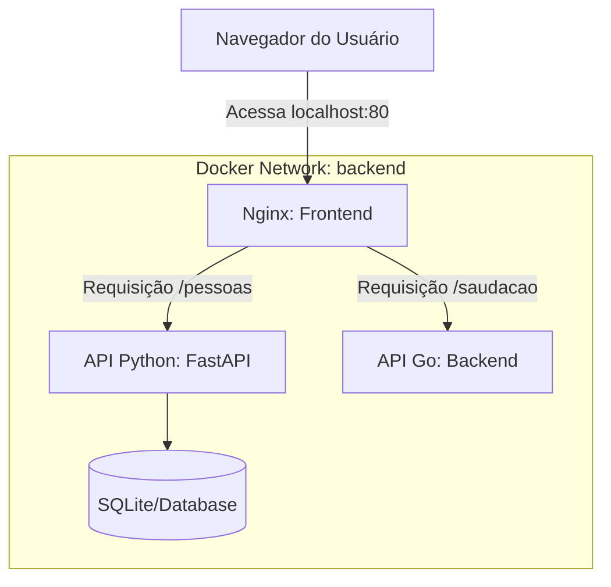

# Desafio Docker: Orquestração de Microsserviços 🚀

Este projeto faz parte do desafio de Docker do programa **Avanti**, focado na criação e orquestração de um ecossistema de microsserviços utilizando **Docker Compose**.

## 📸 Demonstração do Sistema
Aqui está o sistema orquestrado funcionando em ambiente local:


## 🏗️ Arquitetura do Projeto
O sistema é composto por três serviços que comunicam entre si em redes isoladas:




- **Frontend**: Servidor Nginx servindo uma interface estática.
- **API de Pessoas**: Microserviço em **Python (FastAPI)** que gera nomes aleatórios.
- **API de Saudações**: Microserviço em **Go** que gera saudações aleatórias.

## 🛠️ Tecnologias e Conceitos Aplicados
- **Docker & Docker Compose**: Orquestração completa dos serviços.
- **Redes Isoladas**: Comunicação segura entre os backends.
- **Imagens Otimizadas**: Utilização de `.dockerignore` para builds mais leves.
- **Multi-linguagem**: Integração de serviços em Python e Go.

## 🚀 Como Executar o Projeto
Certifica-te de que tens o Docker instalado e, na raiz do projeto, executa:

```bash
docker-compose up -d --build
